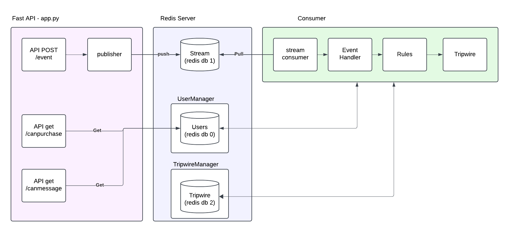

Here’s the revised README with your specifications:

---

# Feature Restriction Service

## Overview

The **Feature Restriction Service** is a high-performance system designed to manage user-based feature restrictions. It leverages FastAPI for the backend, Redis for real-time data storage, and a consumer to process Redis streams. The system can scale to handle high request rates and supports various rules with a tripwire mechanism to manage rule thresholds. It is able to ingest 100 to 1K (valley to peak) new events per second & respond to 100 to 1K requests for feature restrictions.



---

## Project Structure

```text
.
├── app.py                       # FastAPI application entry point
├── stream_consumer.py           # Redis Stream Consumer script
├── feature_restriction/         # Application modules
│   ├── config.py                # Configuration settings (e.g., Redis DBs)
│   ├── models.py                # Pydantic models for events and user data
│   ├── redis_user_manager.py    # User data management logic
│   ├── tripwire_manager.py      # Tripwire management logic
│   ├── rules.py                 # Business rules for events
│   ├── utils.py                 # Utility functions and helpers
│   ├── registry.py              # Event handler registry
│   ├── publisher.py             # RedisEventPublisher class
│   ├── endpoint_access.py       # Abstraction of get access logic
├── tests/                       # Test suite
│   ├── unit/                    # Unit tests
│   ├── integration/             # Integration tests
│   ├── load/                    # Load testing scripts
│   │   ├── locustfile.py        # Locust configuration for load testing
├── requirements.txt             # Python dependencies
├── Dockerfile                   # Dockerfile for the FastAPI app
├── docker-compose.yml           # Docker Compose file for all services
```


---

## Data Flow Description

1. **Event Ingestion**:
   - Events are posted to the FastAPI `/event` endpoint.
   - Events are stored in a Redis stream.

2. **Stream Processing - Event Handling, Rules, and Tripwires**:
   - The Stream Consumer reads events from the Redis stream.
   - Events are processed based on their `name` field, updating user data.
   - User data is assessed against various rules. If a rule is violated, feature access is restricted.
   - Rules are evaluated for potential tripwire activation. Tripwires disable rules when thresholds are exceeded.

3. **Feature Restriction Queries**:
   - Clients query endpoints such as `/canmessage` or `/canpurchase` to check feature availability for users.
   - Responses are determined by processed user data in Redis.

---


## Setup, Starting, and Using the System

### Prerequisites

1. **Docker**: Ensure Docker and Docker Compose are installed.
   - [Install Docker](https://docs.docker.com/get-docker/)
   - [Install Docker Compose](https://docs.docker.com/compose/install/)

2. **Postman or Curl**: For testing API endpoints.

---

### Starting the System

1. **Start Services**:
   ```bash
   docker-compose up --build
   ```

2. **Endpoint**:
   - Endpoint (publisher): [http://localhost:8000](http://localhost:8000) 

3. **Stop Services**:
   ```bash
   docker-compose down
   ```

---

### Using the System

#### Available Endpoints

1. **POST /event**: Add an event to the system.
   - Example payload for `scam_message_flagged`:
     ```json
     {
       "name": "scam_message_flagged",
       "event_properties": {
         "user_id": "12345"
       }
     }
     ```
   - Response:
     ```json
     {
         "status": "Event 'scam_message_flagged' added to the stream."
      }
     ```

2. **GET /canmessage?user_id={user_id}**: Check if the user can send messages.

   - Response:
      ```json
         {
            "can_message": true
         }
      ```

3. **GET /canpurchase?user_id={user_id}**: Check if the user can make purchases.
   - Response:
      ```json
         {
            "can_purchase": true
         }
      ```

**note**: with container running, see link for swagger docs: http://localhost:8000/docs#/

---

## Running Tests

### Prerequisites

1. **Python Environment**:
   - Install Conda: [Miniconda Installation](https://docs.conda.io/en/latest/miniconda.html).
   - Create a Conda environment:
     ```bash
     conda create -n feature-restriction python=3.10
     conda activate feature-restriction
     ```
   - Install dependencies:
     ```bash
     pip install -r requirements.txt
     ```
   


---

### Integration Tests

**Redis** must be **installed** on your system:

      ```bash
      brew install redis
      ```

1. **Start Redis Server**: Ensure a Redis instance is running locally:

   ```bash
   redis-server
   ```


2. Run the integration tests:
   ```bash
   pytest tests/integration
   ```

---
### Unit Tests

1. To run the unit tests, use the following command:
   ```bash
   pytest tests/unit
   ```
   **note**: make sure redis is NOT running.

2. To get a coverage report in your terminal:
   ```bash
   pytest --cov=feature_restriction tests/unit
   ```

---

### Load Tests with Locust

1. Start the Docker containers:
   ```bash
   docker-compose up
   ```

2. Run Locust:
   ```bash
   locust -f tests/load/locustfile.py
   ```

3. Open the Locust web interface: [http://localhost:8089](http://localhost:8089).  **Note**: tests run with 100 users and 50 ramp up for 30 seconds.


---

### Adding New Event Handlers and Rules

The system is designed to be extensible. Follow these steps to add new rules and event handlers.

---

#### **1. Adding a New Rule**

**File**: `feature_restriction/rules.py`

Create a new rule by subclassing `BaseRule` and implementing the `evaluate_rule` and `apply_rule` methods.

##### Example:
```python
from feature_restriction.rules import BaseRule

class NewRule(BaseRule):
    name = "new_rule"

    def evaluate_rule(self, user_data):
        pass  # Logic for evaluating the rule condition

    def apply_rule(self, user_data):
        pass  # Logic for applying the rule
```

---

**File**: `feature_restriction/registry.py`

Register the new rule in the `register_default` method of the `RuleRegistry`:
```python
def register_default(self, tripwire_manager, user_manager):
    self.register(NewRule(tripwire_manager, user_manager))
```

---

#### **2. Adding a New Event Handler**

**File**: `feature_restriction/event_handlers.py`

Create a new event handler by subclassing `BaseEventHandler` and implementing the `handle` method.

##### Example:
```python
from feature_restriction.event_handlers import BaseEventHandler

class NewEventHandler(BaseEventHandler):
    event_name = "new_event"

    def handle(self, event, user_data):
        pass  # Logic for handling the event
```

---

**File**: `feature_restriction/registry.py`

Register the new event handler in the `register_default` method of the `EventHandlerRegistry`:
```python
def register_default(self, tripwire_manager, user_manager):
    self.register(
        NewEventHandler(tripwire_manager, user_manager),
        rule_names=["new_rule"]  # Associate with any applicable rules
    )
```

---

#### **3. Processing Events and Rules**

The `RedisStreamConsumer` automatically processes registered event handlers and their associated rules.

**No changes required** to the stream consumer logic, as it dynamically retrieves the handlers and rules from the registries.


---

### Kill Redis
Sometimes a redis server is left running. To kill it:
1. Find Redis Process ID:
   ```bash
   ps aux | grep redis
   ```

2. kill {insert PID from previous step}
```bash
  kill PID
   ```


 
